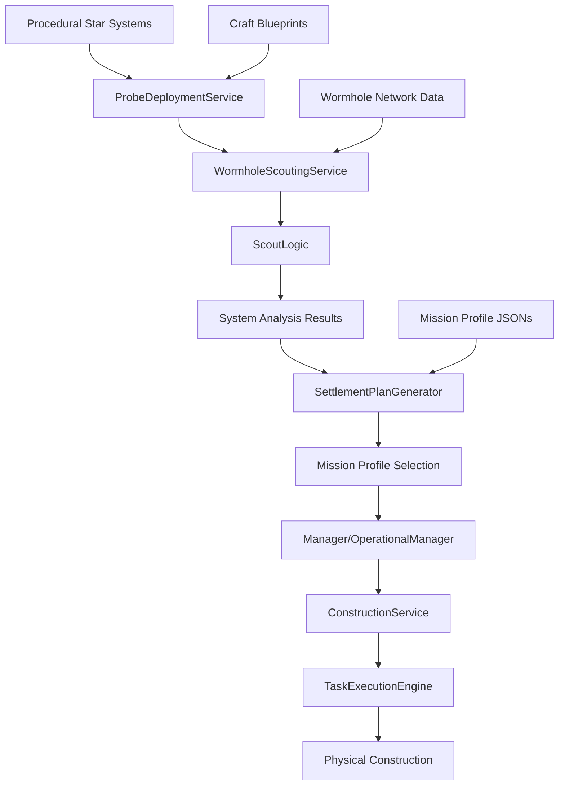
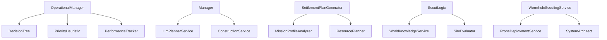

# AI Manager Architecture Overview

## Module Structure

The AI Manager is a comprehensive autonomous system responsible for Galaxy Game's interplanetary expansion, settlement planning, and resource management. It consists of 30+ specialized services organized into a modular architecture.

### Core Service Categories

#### 🤖 **Core Management Services**
- **`manager.rb`** - Main AI coordinator for settlement construction and expansion
- **`operational_manager.rb`** - Real-time operational decision making and pattern execution
- **`system_architect.rb`** - Wormhole link management and infrastructure deployment

#### 🔍 **Analysis & Intelligence Services**
- **`scout_logic.rb`** - System analysis and settlement opportunity identification
- **`mission_profile_analyzer.rb`** - Mission pattern recognition and classification
- **`world_knowledge_service.rb`** - Planetary data analysis and habitability assessment
- **`sim_evaluator.rb`** - Simulation evaluation and outcome prediction

#### 📋 **Planning & Generation Services**
- **`settlement_plan_generator.rb`** - Comprehensive settlement planning with tug integration
- **`resource_planner.rb`** - Resource allocation and procurement optimization
- **`llm_planner_service.rb`** - AI-powered strategic planning using language models

#### 🚀 **Exploration & Deployment Services**
- **`probe_deployment_service.rb`** - Autonomous probe deployment for system scouting
- **`wormhole_scouting_service.rb`** - Wormhole network expansion and opportunity evaluation
- **`wormhole_placement_service.rb`** - Strategic wormhole positioning and maintenance

#### 🏗️ **Construction & Operations Services**
- **`construction_service.rb`** - Construction job management and coordination
- **`builder.rb`** - Physical construction execution and resource management
- **`production_manager.rb`** - Manufacturing and production optimization

#### 💰 **Economic & Resource Services**
- **`financial_service.rb`** - Economic decision making and GCC management
- **`procurement_service.rb`** - Resource acquisition and market interaction
- **`resource_acquisition_service.rb`** - Strategic resource procurement planning

#### 🎯 **Decision & Control Services**
- **`decision_tree.rb`** - Hierarchical decision-making framework
- **`priority_heuristic.rb`** - Priority calculation and task ranking
- **`ai_priority_system.rb`** - Advanced priority management and adaptation

#### 📊 **Learning & Adaptation Services**
- **`performance_tracker.rb`** - Performance monitoring and learning
- **`pattern_loader.rb`** - Mission pattern loading and management
- **`pattern_validator.rb`** - Pattern validation and optimization

#### 🔧 **Utility & Support Services**
- **`manifest_parser.rb`** - Mission manifest parsing and interpretation
- **`contract_creation_service.rb`** - Contract generation for missions
- **`emergency_mission_service.rb`** - Emergency response and crisis management

## Service Responsibilities

### Manager: Initial Construction Coordination
**File**: `app/services/ai_manager/manager.rb`

The Manager service is the primary entry point for AI-driven settlement development. It coordinates initial construction phases and determines expansion needs.

```ruby
class Manager
  def advance_time
    if @target_entity.is_a?(Structure::Lavatube) && !settlement_established?(@target_entity)
      run_initial_construction(@target_entity)
    elsif @target_entity.is_a?(Settlement::BaseSettlement) && needs_expansion?(@target_entity)
      run_expansion_plan(@target_entity)
    end
  end
end
```

### ScoutLogic: System Analysis and Pattern Detection
**File**: `app/services/ai_manager/scout_logic.rb`

ScoutLogic analyzes new star systems to identify settlement opportunities and resource potential. It prioritizes targets based on habitability, resources, and strategic value.

```ruby
class ScoutLogic
  def execute_alpha_centauri_scouting
    # Priority 1: Search for Ice-rich Asteroids
    ice_asteroids = discover_ice_rich_asteroids
    if ice_asteroids.any?
      authorize_water_electrolysis_plant(ice_asteroids.first)
      return
    end
    # Priority 2: Search for Gas Giants
    # ...additional prioritization logic
  end
end
```

### SettlementPlanGenerator: Mission Planning with Tug Integration
**File**: `app/services/ai_manager/settlement_plan_generator.rb`

Generates comprehensive settlement plans that integrate asteroid relocation tugs for moon and asteroid-based settlements. Links settlement plans to mission profiles and cycler configurations.

```ruby
class SettlementPlanGenerator
  def generate_settlement_plan
    base_plan = create_base_plan
    
    # Add specialized craft for moon/asteroid targets
    if moon_or_asteroid_target?(@analysis[:target_body])
      base_plan[:specialized_craft] = generate_asteroid_tug_config
      base_plan[:phases].insert(1, "asteroid_capture_and_conversion")
    end
    
    base_plan[:mission_profile] = select_mission_profile(@analysis)
    base_plan[:cycler_config] = select_cycler_config(@analysis)
  end
end
```

### ProbeDeploymentService: Wormhole Scouting Probe Deployment
**File**: `app/services/ai_manager/probe_deployment_service.rb`

Handles autonomous deployment of scouting probes to unexplored systems. Prioritizes EM detection, resource assessment, and habitability analysis.

```ruby
class ProbeDeploymentService
  def deploy_scout_probes
    # Priority 1: EM Detection Probe
    em_probe = deploy_probe(
      type: "generic_probe",
      config: "em_detection_probe_data",
      target: @target_system,
      priority: 1
    )
    # Additional probe types for comprehensive scouting
  end
end
```

### WormholeScoutingService: Full Scouting Mission Orchestration
**File**: `app/services/ai_manager/wormhole_scouting_service.rb`

Evaluates and selects optimal star systems for wormhole scouting missions. Scores systems based on resource potential, expansion value, and strategic positioning.

```ruby
class WormholeScoutingService
  def evaluate_scouting_opportunities
    candidate_systems = select_candidate_systems
    scored_systems = score_systems_for_scouting(candidate_systems)
    
    # Return top candidates sorted by score
    scored_systems.sort_by { |system| -system[:scouting_score] }.first(5)
  end
end
```

### SystemArchitect: Deployment Template Execution
**File**: `app/services/ai_manager/system_architect.rb`

Executes deployment templates for wormhole infrastructure and settlement establishment. Manages maintenance costs, ROI calculations, and system optimization.

```ruby
class SystemArchitect
  def apply_sabatier_refinements(link_id)
    # Apply maintenance tax discounts based on active Sabatier units
    if sabatier_units_active?(link_id)
      # Discount logic for wormhole maintenance
    end
  end
end
```

## Data Flow Architecture



### Procedural Systems Pipeline

1. **System Generation** → Procedural star systems are created with randomized celestial bodies
2. **Probe Deployment** → Generic probes are deployed for initial reconnaissance
3. **Data Collection** → Probes gather EM signatures, resource data, and habitability metrics
4. **Analysis Phase** → ScoutLogic processes probe data and identifies settlement opportunities
5. **Planning Phase** → SettlementPlanGenerator creates detailed mission plans with tug integration
6. **Mission Linking** → Plans connect to predefined mission profile JSONs
7. **Execution Phase** → Manager/OperationalManager coordinates construction through TaskExecutionEngine

### Probe Data Integration

- **EM Detection**: Identifies residual exotic matter for wormhole stabilization
- **Resource Assessment**: Maps mineral deposits, ice reserves, and atmospheric composition
- **Habitability Analysis**: Evaluates temperature, pressure, and radiation levels
- **Strategic Positioning**: Analyzes orbital mechanics and system connectivity

### Analysis to Planning Flow

- **Pattern Recognition**: Mission profiles are classified (lunar, venus, mars, titan patterns)
- **Resource Matching**: Available resources matched against mission requirements
- **Tug Integration**: Asteroid relocation capabilities added for moon/asteroid targets
- **Economic Analysis**: GCC costs and revenue projections calculated

### Mission Profile Integration

Settlement plans link to JSON-defined mission profiles:

```json
{
  "lunar_precursor": {
    "phases": ["landing_setup", "power_infrastructure", "isru_activation"],
    "equipment": ["habitat_modules", "regolith_processors"],
    "estimated_duration": "6_months"
  }
}
```

## Integration Points

### Mission Profile JSONs
**Location**: `data/json-data/missions/`

The AI Manager integrates with predefined mission profiles that define:
- Phase structures and sequencing
- Equipment requirements and transfer logic
- Duration estimates and success criteria
- Pattern recognition templates

**Key Profiles**:
- `lunar_precursor` - Basic lunar settlement establishment
- `venus_atmospheric` - Venus gas giant harvesting
- `mars_terraforming` - Mars surface modification
- `titan_hydrocarbon` - Titan methane extraction

### Craft Blueprints
**Location**: `data/json-data/operational_data/crafts/`

AI services reference craft blueprints for:
- **Generic probes** - System scouting and reconnaissance
- **Asteroid relocation tugs** - Orbital mechanics and capture operations
- **Cycler configurations** - Interplanetary transport and mobile basing

### Wormhole Expansion Flow

1. **Opportunity Evaluation** → WormholeScoutingService identifies candidate systems
2. **Probe Deployment** → Initial probes assess system viability
3. **EM Assessment** → Residual exotic matter evaluated for stabilization
4. **Link Establishment** → SystemArchitect manages wormhole creation
5. **Maintenance Optimization** → Ongoing cost management and efficiency improvements

### Economic Integration

- **GCC Tracking**: All AI decisions include economic impact assessment
- **Procurement Logic**: Resource acquisition through market or ISRU
- **ROI Analysis**: Settlement viability based on resource value vs. development cost
- **Priority Weighting**: Economic factors influence decision prioritization

## Service Dependencies



## Configuration and Adaptation

### Pattern Learning System
- Mission outcomes tracked by PerformanceTracker
- Successful patterns reinforced, unsuccessful patterns deprioritized
- Dynamic adaptation based on environmental conditions

### Priority Adaptation
- AiPrioritySystem adjusts weights based on system state
- Emergency conditions trigger priority overrides
- Economic factors influence decision weighting

### World Knowledge Integration
- Planetary data continuously updated from probe results
- Habitability models refined with real operational data
- Resource availability predictions improved over time

This architecture enables autonomous interplanetary expansion while maintaining economic viability and strategic adaptability.