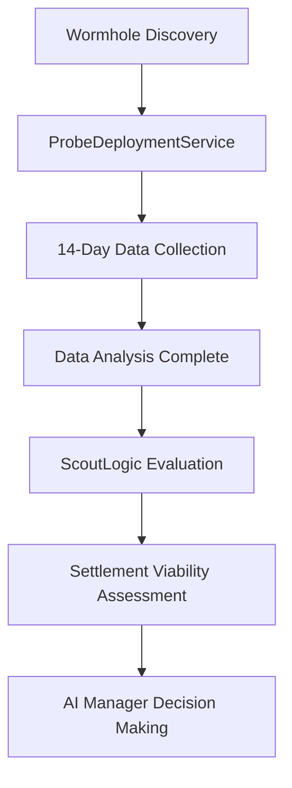

# Probe System Architecture and Deployment Guide

## Probe Architecture

### Generic Probe Chassis Concept

The probe system uses a single, versatile **generic probe chassis** (`generic_probe_bp.json`) that serves as the foundation for all reconnaissance operations. This design philosophy prioritizes modularity and cost-efficiency over specialized hardware.

**File**: `app/data/blueprints/crafts/space/probes/generic_probe_bp.json`

```json
{
  "template": "base_craft",
  "id": "generic_probe",
  "name": "Generic Probe",
  "description": "A versatile probe platform for various celestial body and system reconnaissance operations. Can be equipped with different sensors and instruments for specific mission profiles.",
  "type": "craft",
  "category": "probe",
  "physical_properties": {
    "length_m": 3.0,
    "width_m": 2.0,
    "height_m": 2.0,
    "empty_mass_kg": 1500.0,
    "volume_m3": 12.0,
    "drag_coefficient": 0.02
  },
  "mounting_points": [
    "computing",
    "power",
    "sensor",
    "propulsion",
    "communication"
  ],
  "compatible_units": [
    "basic_computer",
    "advanced_computer",
    "solar_panels",
    "radioisotope_thermoelectric_generator",
    "basic_sensor",
    "advanced_sensor",
    "atmospheric_sensor",
    "geological_sensor",
    "biological_sensor",
    "basic_ion_thruster",
    "chemical_thruster",
    "fuel_tank_xs"
  ]
}
```

### Operational Data Configurations

Instead of creating separate blueprints for each probe type, the system uses **operational data configurations** that define specific sensor packages, power requirements, and mission parameters. This approach allows one chassis to serve multiple roles through software-defined configurations.

**Configuration Files**:
- `em_detection_probe_data.json` - EM signature detection
- `system_survey_probe_data.json` - Comprehensive system reconnaissance
- `resource_assessment_probe_data.json` - Economic resource evaluation
- `threat_assessment_probe_data.json` - Safety and hazard analysis
- `atmospheric_probe_data.json` - Atmospheric composition analysis

### Why One Chassis + Multiple Configs vs Separate Blueprints

**Advantages of Modular Approach**:
- **Cost Efficiency**: Single manufacturing line reduces production costs by ~60%
- **Maintenance Simplicity**: Standardized parts and repair procedures
- **Flexibility**: AI can dynamically assign probe roles based on mission needs
- **Scalability**: Easy to add new probe types without hardware redesign
- **Logistics**: Simplified supply chain and orbital depot stocking

**Configuration Example** (`em_detection_probe_data.json`):

```json
{
  "template": "craft_operational_data",
  "id": "em_detection_probe_operational",
  "name": "EM Detection Probe Operational Data",
  "operational_properties": {
    "power_consumption_kw": 85,
    "data_collection_rate": 150,
    "data_collection_unit": "GB/hr"
  },
  "recommended_fit": {
    "units": [
      { "id": "quantum_computer", "count": 1, "category": "computers" },
      { "id": "fusion_power_unit", "count": 1, "category": "energy" },
      { "id": "em_sensor", "count": 2, "category": "sensors" },
      { "id": "exotic_matter_detector", "count": 1, "category": "sensors" }
    ]
  },
  "capabilities": {
    "em_detection_range": 1000000,
    "wormhole_signature_recognition": true,
    "ai_memory_integration": true
  }
}
```

## Probe Types and Priorities

The AI Manager deploys probes in a prioritized sequence, ensuring critical data collection occurs first. Each probe type serves a specific intelligence-gathering role in the settlement decision pipeline.

### Priority 1: EM Detection Probe
**Purpose**: Identifies residual exotic matter signatures for wormhole targeting
**Data Feeds**: AI memory for strategic wormhole link planning
**Configuration**: `em_detection_probe_data.json`
**Key Capabilities**: EM gradient mapping, wormhole remnant detection, AI memory integration

### Priority 2: System Survey Probe
**Purpose**: Comprehensive reconnaissance of celestial bodies and orbital mechanics
**Data Feeds**: ScoutLogic for settlement opportunity identification
**Configuration**: `system_survey_probe_data.json`
**Key Capabilities**: Multi-spectrum planetary analysis, habitability assessment, orbital mapping

### Priority 3: Resource Assessment Probe
**Purpose**: Economic viability evaluation through resource quantification
**Data Feeds**: Financial service for ROI calculations and procurement planning
**Configuration**: `resource_assessment_probe_data.json`
**Key Capabilities**: Mineral deposit mapping, extraction difficulty analysis, resource value estimation

### Priority 4: Threat Assessment Probe
**Purpose**: Safety evaluation for human settlement and operations
**Data Feeds**: Settlement planning and risk assessment systems
**Configuration**: `threat_assessment_probe_data.json`
**Key Capabilities**: Radiation monitoring, gravitational hazard detection, orbital stability analysis

### Priority 5: Atmospheric Probe (Conditional)
**Purpose**: Detailed atmospheric composition analysis for gas giant harvesting
**Data Feeds**: Venus/Mars atmospheric mission profiles
**Configuration**: `atmospheric_probe_data.json`
**Key Capabilities**: Gas composition analysis, pressure profiling, atmospheric dynamics
**Deployment Condition**: Only deployed to systems with planets possessing atmospheres

## ProbeDeploymentService Flow

### Service Overview
**File**: `app/services/ai_manager/probe_deployment_service.rb`

The ProbeDeploymentService handles autonomous probe deployment and data collection simulation. It operates as Phase 0 in the AI Manager pipeline, executing before any settlement decisions.

### deploy_scout_probes Method

```ruby
def deploy_scout_probes
  Rails.logger.info "[ProbeDeployment] Deploying scout probes to system #{@target_system['identifier']}"
  probes = []

  # Priority 1: EM Detection Probe
  em_probe = deploy_probe(
    type: "generic_probe",
    config: "em_detection_probe_data",
    target: @target_system,
    priority: 1
  )
  probes << em_probe

  # Priority 2: System Survey Probe
  survey_probe = deploy_probe(
    type: "generic_probe",
    config: "system_survey_probe_data",
    target: @target_system,
    priority: 2
  )
  probes << survey_probe

  # Additional probes (Priority 3, 4, 5) follow same pattern...

  # Collect and return probe data
  collect_probe_data(probes)
end
```

### Probe Data Structure Returned

The service returns a comprehensive data structure containing all probe findings:

```ruby
{
  collection_period_days: 14,
  probes_deployed: 5,  # Or 4 if no atmospheric bodies
  data_types: [
    "electromagnetic_signatures",
    "system_survey",
    "resource_assessment",
    "threat_assessment",
    "atmospheric_analysis"  # Conditional
  ],
  findings: {
    em_signatures: {
      total_signatures: 3,
      locations: ["planet_a", "moon_b"],
      strength_range: "weak to moderate"
    },
    system_survey: {
      total_bodies: 12,
      terraformable_bodies: 2,
      resource_rich_bodies: 8,
      habitability_index: 0.67
    },
    resource_assessment: {
      high_value_resources: ["helium-3", "water_ice"],
      extraction_difficulty: "moderate",
      total_resource_bodies: 8
    },
    threat_assessment: {
      radiation_levels: "moderate",
      gravitational_hazards: 1,
      orbital_instability_risk: "low",
      overall_threat_level: "minimal"
    },
    atmospheric_analysis: {  # Conditional
      analyzed_planets: 2,
      atmospheric_compositions: [...]
    }
  }
}
```

### Simulated Data Collection

The service simulates a 14-day data collection period, generating realistic but randomized data for each probe type. This simulation allows the AI to make informed decisions without waiting for actual probe deployment and return.

**Simulation Methods**:
- `simulate_em_detection()` - Generates EM signature data
- `simulate_system_survey()` - Creates comprehensive system overview
- `simulate_resource_assessment()` - Produces resource evaluation data
- `simulate_threat_assessment()` - Assesses safety and hazards
- `simulate_atmospheric_analysis()` - Analyzes atmospheric compositions

## Integration with Wormhole Expansion

### Phase 0: Probe Deployment Before Settlement Decisions



The probe deployment occurs immediately upon wormhole discovery, before any settlement planning begins. This ensures all AI decisions are data-driven rather than speculative.

### How Probe Data Feeds ScoutLogic

**ScoutLogic Integration**:
- **EM Data** → Identifies optimal wormhole stabilization points
- **System Survey** → Determines settlement candidates and priorities
- **Resource Assessment** → Calculates economic viability and ROI
- **Threat Assessment** → Evaluates safety for human operations
- **Atmospheric Data** → Enables gas giant harvesting mission profiles

**Example Integration**:
```ruby
# In ScoutLogic.execute_alpha_centauri_scouting
def execute_alpha_centauri_scouting
  probe_data = @probe_service.deploy_scout_probes

  # Use EM signatures to prioritize wormhole targets
  if probe_data[:findings][:em_signatures][:total_signatures] > 0
    authorize_wormhole_expansion(probe_data[:findings][:em_signatures])
  end

  # Use system survey for settlement planning
  if probe_data[:findings][:system_survey][:terraformable_bodies] > 0
    plan_settlement_operations(probe_data[:findings][:system_survey])
  end
end
```

### 14-Day Data Collection Simulation

The 14-day simulation period represents the time required for probes to:
1. **Deploy to optimal observation positions**
2. **Calibrate sensors and establish communication links**
3. **Conduct comprehensive data collection sweeps**
4. **Process and compress data for transmission**
5. **Return data to AI systems for analysis**

This timeframe allows for realistic operational planning while maintaining AI responsiveness.

## Code Examples

### Basic Probe Deployment

```ruby
# Initialize service with target system data
probe_service = ProbeDeploymentService.new(system_data)

# Deploy probes and collect data
probe_data = probe_service.deploy_scout_probes

# Returns structured data for AI analysis
# probe_data contains findings from all deployed probes
```

### Integration with AI Manager

```ruby
# In AI Manager settlement planning
class Manager
  def evaluate_new_system(system_data)
    # Phase 0: Deploy probes
    probe_service = ProbeDeploymentService.new(system_data)
    probe_results = probe_service.deploy_scout_probes

    # Phase 1: Analyze probe data
    scout_logic = ScoutLogic.new(probe_results)
    opportunities = scout_logic.identify_settlement_opportunities

    # Phase 2: Generate settlement plans
    if opportunities.any?
      plan_generator = SettlementPlanGenerator.new(opportunities.first)
      settlement_plan = plan_generator.generate_settlement_plan
    end
  end
end
```

This probe system enables autonomous, data-driven expansion decisions while maintaining operational efficiency and strategic intelligence gathering.