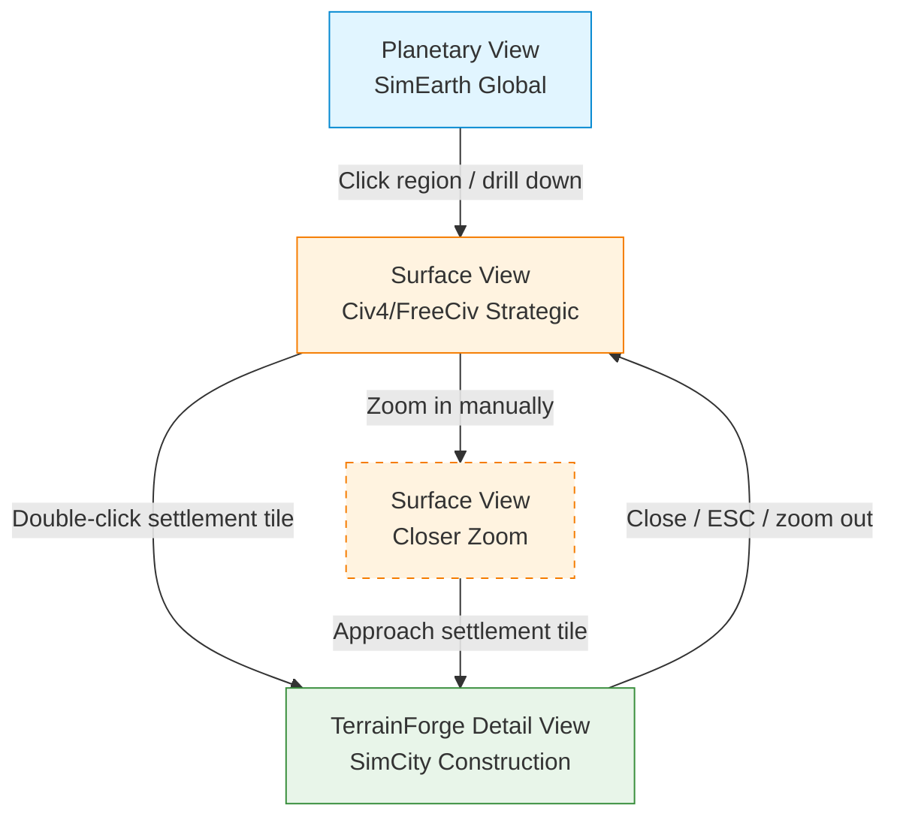

# Three-Layer View Architecture & Integration

**Created**: 2026-07-13  
**Last Updated**: 2026-07-27  
**Author**: Implementation Agent (qwen)  
**Status**: Complete  
**Priority**: HIGH  
**Type**: Architecture Specification

---

## Table of Contents

1. [Overview](#overview)
2. [Zoom Hierarchy](#zoom-hierarchy)
3. [Layer Specifications](#layer-specifications)
   - [Planetary View (SimEarth)](#planetary-view-simearth)
   - [Surface View (Civ4/FreeCiv)](#surface-view-civ4freeciv)
   - [TerrainForge Detail View (SimCity)](#terrainforge-detail-view-simcity)
4. [Layer Separation Rules](#layer-separation-rules)
5. [Data Flow & Ownership](#data-flow--ownership)
6. [Integration Points](#integration-points)
7. [Rendering Technology Recommendations](#rendering-technology-recommendations)
8. [Scope Boundaries](#scope-boundaries)
9. [Current Surface View State](#current-surface-view-state)

---

## Overview

Galaxy Game UI requires **three distinct operational levels** for celestial body interaction rather than a monolithic surface map. This document establishes the complete rendering and interaction architecture, data flow, zoom hierarchy, and layer separation rules to prevent scope creep in future implementation tasks.

### Core Principle

> **Surface View and TerrainForge share the same rendering pipeline.** TerrainForge is NOT a separate rendering engine — it is `surface_view.js` with camera zoomed 10-100x on a single settlement tile. The difference is camera state (scale, offsetX, offsetY) and viewport focus only.

---

## Zoom Hierarchy



### Zoom Navigation Flow

```
Planetary View (overview)
  ├─ Rotation/pan on globe
  └─ Click region / "drill down" button
       ↓
Surface View (settlement region)
   ├─ Pan/zoom within region
   ├─ Layer toggles (terrain, improvements, units, settlements)
   └─ Double-click SETTLEMENT TILE / "enter settlement" button
        ↓
    TerrainForge View (detail of that settlement tile)
       ├─ View all buildings on this tile
       ├─ Click building to configure
       ├─ Drag-place new structures
       ├─ Connect pipelines/roads between buildings
       └─ Close / "back to map" button
            ↑
        Surface View (return — same camera position preserved)
```

### Context Preservation Rules

| Transition | Camera Tracking | Time Behavior | Data Sync |
|---|---|---|---|
| Planetary → Surface | Center on clicked region | Continue running | Load terrain_data for region |
| Surface → TerrainForge | Freeze at settlement tile center | Pause (or continue in background) | Fetch buildings on this tile from terrain_data |
| TerrainForge → Surface | Resume at frozen position | Resume | Reflect building parameter changes |

---

## Layer Specifications

### Planetary View (SimEarth)

**Status**: Specification only — OUT OF SCOPE for current work. Define interface contract, do not implement.

#### Purpose
See entire world at macro scale: atmospheric layers, cloud formations, weather systems, biome distribution. Used for orbital overview and terraforming progress monitoring.

#### Render Options
- **3D Globe** (Three.js / Babylon.js) — immersive, rotation support
- **2D Flattened Projection** (Canvas/WebGL) — simpler, lower performance cost

#### Data Requirements
| Data Field | Source | Description |
|---|---|---|
| `atmosphere_layers` | `celestial_body.atmosphere_layers` | Atmospheric composition per altitude band |
| `biome_distribution` | `terrain_data.biomes` | Global biome heatmap |
| `weather_grid` | `planet_data.weather_grid` | Macro weather system state |
| `cloud_formations` | `planet_data.clouds` | Visual cloud layer data |
| `elevation_global` | `terrain_data.elevation` (full grid) | Base terrain for projection coloring |

#### Interface Contract: Click Region → Surface View
```javascript
// Planetary View must expose this method for zoom transition:
function drillDownToSurfaceView(regionCoordinates) {
  // 1. Determine which Surface View tile region corresponds to clicked coordinates
  const surfaceRegion = planetaryToSurfaceMapping(regionCoordinates);
  
  // 2. Initialize Surface View with camera centered on that region
  window.SurfaceView.init({
    centerTile: surfaceRegion.centerTile,
    zoomLevel: surfaceRegion.initialZoom,
    planetId: surfaceRegion.planetId
  });
  
  // 3. Smooth transition (fade or zoom animation)
  animateTransition('planetary', 'surface');
}
```

#### Explicitly OUT OF SCOPE
- ❌ No settlement-level detail (tiles, improvements, units, settlement markers)
- ❌ No implementation in this task or current Surface View work
- ❌ No terrain_data fields specific to Planetary View — use shared data only

---

### Surface View (Civ4/FreeCiv)

**Status**: PRIMARY FOCUS — Current implementation exists at `galaxy_game/app/assets/javascripts/surface_view.js`. This spec documents and extends the current state.

#### Purpose
Tactical-level settlement management: resource/improvement display, unit movement and orders, city overlay and yield management, layer toggles for clarity. Same view for Admin (AI planning) and Player (unit orders), with different overlays.

#### Current Implementation State

**File**: `galaxy_game/app/assets/javascripts/surface_view.js`

| Aspect | Current State | Notes |
|---|---|---|
| **Rendering Pipeline** | 4-layer canvas compositing | Layer 0: elevation, Layer 1: liquid, Layer 2: biomes, Layer 3: resources |
| **Tile Size** | Fixed 32px (Civ4 feel) | Player zooms in/out rather than auto-scaling |
| **Viewport Culling** | ✅ Implemented | Only visible tiles drawn each frame |
| **RAF Loop** | ✅ Dirty-flag pattern | `rafId`, `dirty` flag, RAF-based re-render |
| **Camera State** | `scale`, `offsetX`, `offsetY`, `isDragging` | Pan and zoom via mouse drag + scroll wheel |
| **Layer Toggles** | `visibleLayers` Set | terrain, liquid, biomes toggles |
| **BiomeRenderer** | ✅ PNG sprite support | 12 biome tiles; falls back to color if sprites missing |
| **Unit Layer (Layer 5)** | ⚠️ GATED OFF | `showUnits: false` — sprites misaligned/malformed (see NEEDS_REVIEW.md) |
| **Terrain Data** | `this.terrain = this.data.terrain_data` | Loaded from injected JSON (`surface-data` element) |
| **Planet Identity** | `window.PLANET_NAME`, `window.PLANET_TYPE` | Set via ERB footer unescaped globals |

#### Rendering Pipeline (Current)

```
Layer 0: Elevation (always shown) — grayscale or color-mapped from physical properties
Layer 1: Liquid (hydrosphere bathtub fill) — composition-aware coloring (H2O=blue, CH4=orange)
Layer 2: Biomes (full biome color map) — Earth-class worlds only; PNG sprites when available
Layer 3: Resources (optional overlay) — deposit markers from orbital survey
Layer 4: Civilization (spaceports, bases, roads, worldhouse panels) — planned
Layer 5: Units (probes, scouts, harvesters, transports) — always on top, GATED OFF
```

#### Surface View Architecture Specification

##### Grid System
| Celestial Body | Grid Size | @64px tiles | Total Tiles |
|---|---|---|---|
| Earth | 180×90 | 11,520×5,760 | 16,200 |
| Mars | 96×48 | 6,144×3,072 | 4,608 |
| Luna | 50×25 | 3,200×1,600 | 1,250 |

##### Camera Zoom Levels
| Zoom Level | Scale | Use Case |
|---|---|---|
| Min (Planetary transition) | ~0.3x | See entire surface region |
| Default | 1.0x | Standard tactical view (current default) |
| Mid | 2.0-5.0x | Closer inspection of terrain/features |
| Settlement approach | 8.0-15x | Approaching a settlement tile |
| TerrainForge entry | 10-100x | Single settlement tile detail view |

##### Layer System (Implementation)
```javascript
// Current visibleLayers Set usage:
window.SurfaceView.visibleLayers = new Set(['terrain', 'liquid', 'biomes']);

// Toggle layer visibility:
function toggleLayer(layerName) {
  if (this.visibleLayers.has(layerName)) {
    this.visibleLayers.delete(layerName);
  } else {
    this.visibleLayers.add(layerName);
  }
  this.dirty = true; // Trigger RAF re-render
}
```

##### Data Flow: Backend → Surface View
```
celestial_body model
  └─ terrain_data (JSON)
       ├─ elevation[] — grid elevation values
       ├─ biomes[] — biome type per tile
       ├─ resources[] — resource deposit locations
       ├─ hydrosphere[] — liquid coverage per tile
       └─ improvements[] — existing improvements (roads, farms, mines)

injected via ERB:
  <div id="surface-data" style="display:none">
    { terrain_data: ..., planet_data: ..., planet_name: "...", planet_type: "..." }
  </div>

surface_view.js init():
  this.data = JSON.parse(document.getElementById('surface-data').textContent)
  this.terrain = this.data.terrain_data
  this.planetData = this.data.planet_data || {}
```

---

### TerrainForge Detail View (SimCity)

**Status**: Specification only — NOT yet implemented. Same rendering system as Surface View, camera zoomed in on one settlement tile.

#### Purpose
Detailed base and worldhouse building placement at readable scale: click building to configure operational parameters (production rate, staffing, inventory), drag-place new structures, connect pipelines/roads between buildings.

#### Critical Architecture Rule

> **TerrainForge IS NOT a separate rendering engine.** It is `surface_view.js` with camera zoomed 10-100x on a single settlement tile. Same sprites, same layer system, different camera state.

#### Implementation Specification

##### Camera State Transition
```javascript
// Enter TerrainForge from Surface View:
function enterTerrainForge(settlementTile) {
  // 1. Freeze Surface View time (optional: continue or freeze)
  this._pauseSurfaceTime();
  
  // 2. Zoom camera to settlement tile center at 10-100x scale
  const tilePixelX = settlementTile.col * TILE_SIZE;
  const tilePixelY = settlementTile.row * TILE_SIZE;
  
  this.scale = 50; // Example: 50x zoom
  this.offsetX = canvas.width / 2 - tilePixelX * this.scale;
  this.offsetY = canvas.height / 2 - tilePixelY * this.scale;
  this.dirty = true;
  
  // 3. Fetch buildings on this settlement tile from terrain_data
  const buildings = this.terrain.settlements.find(s => s.tile === settlementTile)?.buildings || [];
  
  // 4. Render buildings at full scale (same sprites, just larger)
  renderBuildings(buildings);
}

// Exit TerrainForge back to Surface View:
function exitTerrainForge() {
  // 1. Save building parameter changes to terrain_data
  saveBuildingChanges();
  
  // 2. Restore camera to previous Surface View state
  this.scale = this._previousScale;
  this.offsetX = this._previousOffsetX;
  this.offsetY = this._previousOffsetY;
  this.dirty = true;
  
  // 3. Resume Surface View time
  this._resumeSurfaceTime();
}
```

##### Building Display & Interaction
| Feature | Implementation |
|---|---|
| **Building display** | Same sprites as Surface View, rendered at larger scale (10-100x) |
| **Click to configure** | Ray-cast or bounding-box hit detection on building sprites |
| **Drag-place structures** | Mouse drag events → snap to grid within settlement tile bounds |
| **Connect pipelines/roads** | Drag lines between building ports (same improvement system as Surface View) |
| **Layer rendering** | Same layers (terrain, improvements, units) — just zoomed in |

##### Data Flow: TerrainForge ↔ Surface View
```
TerrainForge buildings array ← terrain_data.settlements[N].buildings
Surface View settlement marker ← terrain_data.settlements[N].tile position

When parameters change in TerrainForge:
  1. Update building properties in memory
  2. On exit: persist to terrain_data → save to backend via AJAX
  3. Surface View reflects changes (production rates, staffing, etc.)
```

---

## Layer Separation Rules

### What Each Layer IS Responsible For

| Layer | Responsibilities |
|---|---|
| **Planetary** | Global atmospheric effects, biome heatmap, weather visualization, macro events, rotation/pan on globe |
| **Surface View** | Terrain rendering, improvements (roads/farms/mines), units/vehicles, settlement tiles, Civ4 gameplay, layer toggles, viewport culling |
| **TerrainForge** | Same as Surface View but zoomed on one tile: building display, building configuration, structure placement, pipeline/road connection editing |

### What Each Layer IS NOT Responsible For

| Layer | Explicitly Excluded |
|---|---|
| **Planetary** | Settlement-level detail (tiles, improvements, units, settlement markers), Surface View gameplay mechanics |
| **Surface View** | Planetary atmosphere rendering, global weather systems, biome heatmap at planetary scale |
| **TerrainForge** | Any rendering beyond the single settlement tile it's focused on, planetary-scale data |

### Scope Boundary Enforcement

```
Planetary View ──┐
                 ├──→ DO NOT CROSS → Surface/TerrainForge terrain_data
Surface View  ───┘                  (no atmosphere layers, no biome heatmap)

Surface View ───┐
                ├──→ DO NOT CROSS → Planetary View implementation
TerrainForge ───┘                   (define interface contract only, no globe rendering)

Surface View ──┐
               ├──→ DO NOT CROSS → New TerrainForge renderer
TerrainForge ───┘                  (same surface_view.js, camera zoom only)
```

---

## Data Flow & Ownership

### Data Ownership Matrix

| Data Field | Owned By | Shared With | Notes |
|---|---|---|---|
| `atmosphere_layers` | Planetary View | — | Planetary-only data |
| `weather_grid` | Planetary View | — | Planetary-only data |
| `cloud_formations` | Planetary View | — | Planetary-only data |
| `elevation[]` | **Surface + TerrainForge** (shared) | Planetary (read-only for projection coloring) | Single source of truth |
| `biomes[]` | **Surface + TerrainForge** (shared) | Planetary (read-only for heatmap) | Same data, different visualization |
| `hydrosphere[]` | **Surface + TerrainForge** (shared) | — | Liquid coverage per tile |
| `resources[]` | **Surface + TerrainForge** (shared) | — | Resource deposit locations |
| `improvements[]` | **Surface + TerrainForge** (shared) | — | Roads, farms, mines |
| `settlements[]` | **Surface + TerrainForge** (shared) | — | Settlement tiles with building arrays |
| `units[]` | **Surface + TerrainForge** (shared) | — | Probes, scouts, harvesters, transports |

### Critical Rule: Single terrain_data Object

> **Surface View and TerrainForge share a single `terrain_data` object.** The difference is camera zoom and viewport focus only. Duplicating data causes sync bugs and must be avoided.

```javascript
// ✅ CORRECT: Single shared terrain_data
window.SurfaceView.terrain = {
  elevation: [...],
  biomes: [...],
  resources: [...],
  settlements: [{ tile: {row: 10, col: 20}, buildings: [...] }]
};

// When entering TerrainForge: same object, different camera state
// When exiting TerrainForge: same object, camera restored

// ❌ WRONG: Duplicate terrain_data per layer
const surfaceTerrain = {...terrain_data};  // Duplicates data!
const terrainForgeTerrain = {...terrain_data};  // Duplicates data!
```

---

## Integration Points

### Planetary → Surface Zoom Transition

```javascript
// Triggered when user clicks a region on the planetary globe:
function onPlanetaryRegionClick(regionCoords) {
  // 1. Determine which Surface View tile region corresponds to clicked coordinates
  const surfaceRegion = mapPlanetaryToSurface(regionCoords);
  
  // 2. Initialize Surface View with camera centered on that region
  window.SurfaceView.init({
    centerTile: surfaceRegion.centerTile,
    zoomLevel: surfaceRegion.initialZoom,
    planetId: surfaceRegion.planetId
  });
  
  // 3. Smooth transition animation
  animateTransition('planetary', 'surface');
}
```

### Surface → TerrainForge (Enter Settlement Tile)

```javascript
// Triggered when user double-clicks a settlement tile on the Surface grid:
function onSettlementTileDoubleClick(tile) {
  // 1. Verify tile has a settlement
  const settlement = window.SurfaceView.terrain.settlements.find(s => 
    s.tile.row === tile.row && s.tile.col === tile.col
  );
  if (!settlement) return;
  
  // 2. Save current camera state for restoration
  window.SurfaceView._previousScale = window.SurfaceView.scale;
  window.SurfaceView._previousOffsetX = window.SurfaceView.offsetX;
  window.SurfaceView._previousOffsetY = window.SurfaceView.offsetY;
  
  // 3. Zoom camera to settlement tile center
  const centerX = tile.col * SurfaceView.TILE_SIZE + SurfaceView.TILE_SIZE / 2;
  const centerY = tile.row * SurfaceView.TILE_SIZE + SurfaceView.TILE_SIZE / 2;
  window.SurfaceView.scale = 50; // 50x zoom
  window.SurfaceView.offsetX = canvas.width / 2 - centerX * window.SurfaceView.scale;
  window.SurfaceView.offsetY = canvas.height / 2 - centerY * window.SurfaceView.scale;
  window.SurfaceView.dirty = true;
  
  // 4. Pause Surface View time (optional: continue or freeze)
  window.SurfaceView._pauseSurfaceTime();
  
  // 5. Render buildings on this tile at full scale
  renderBuildings(settlement.buildings);
}
```

### TerrainForge → Surface Return (Exit Settlement Tile)

```javascript
// Triggered when user closes TerrainForge (back button or ESC):
function exitTerrainForge() {
  // 1. Save building parameter changes to terrain_data
  saveBuildingChangesToTerrainData();
  
  // 2. Restore camera to previous Surface View state
  window.SurfaceView.scale = window.SurfaceView._previousScale;
  window.SurfaceView.offsetX = window.SurfaceView._previousOffsetX;
  window.SurfaceView.offsetY = window.SurfaceView._previousOffsetY;
  window.SurfaceView.dirty = true;
  
  // 3. Resume Surface View time
  window.SurfaceView._resumeSurfaceTime();
  
  // 4. Settlement tile still shows same overlay/marker
  // (no changes needed — marker is part of terrain_data.settlements)
}
```

---

## Rendering Technology Recommendations

### Planetary View
| Option | Pros | Cons | Recommendation |
|---|---|---|---|
| **Three.js** | 3D globe, rotation, atmosphere shaders, cloud animation | Higher performance cost, larger bundle | ✅ Preferred for immersive experience |
| **Babylon.js** | Similar to Three.js, better physics | Less community, steeper learning curve | ⚠️ Alternative if Three.js insufficient |
| **2D Canvas + Projection** | Lower cost, simpler | Less immersive, no true 3D rotation | ⚠️ Fallback if performance is critical |

### Surface View (Current — No Changes Needed)
| Aspect | Current Tech | Status |
|---|---|---|
| **Rendering** | 2D Canvas (existing `surface_view.js`) | ✅ Production-ready |
| **Projection** | Orthographic/isometric grid | ✅ Matches Civ4/FreeCiv style |
| **Sprites** | PNG biome tiles + color fallback | ✅ Working, some sprites gated off |
| **Viewport Culling** | RAF dirty-flag loop | ✅ Only visible tiles drawn |
| **Camera** | scale/offsetX/offsetY + mouse drag | ✅ Pan and zoom working |

### TerrainForge Detail View
| Option | Pros | Cons | Recommendation |
|---|---|---|---|
| **2D Canvas (same as Surface)** | Same rendering pipeline, no new code, consistent visuals | Limited 3D depth | ✅ Preferred — same surface_view.js with camera zoom |
| **3D (Three.js)** | Building depth, rotation, complex visuals | New renderer, performance cost, scope creep | ❌ Avoid — contradicts "NOT a separate renderer" rule |

---

## Scope Boundaries

### Surface View Tasks — What IS In Scope
- ✅ Layer toggles (terrain, liquid, biomes, resources, improvements, units)
- ✅ Camera pan/zoom within surface region
- ✅ Settlement tile markers and overlays
- ✅ Improvement display (roads, farms, mines)
- ✅ Unit movement and orders
- ✅ City overlay and yield management
- ✅ Sprite loading and caching (BiomeRenderer)
- ✅ Viewport culling for performance
- ✅ Camera zoom state for TerrainForge entry point

### Surface View Tasks — What IS NOT In Scope
- ❌ Planetary globe rendering (future task)
- ❌ Atmospheric shader implementation (Planetary View only)
- ❌ Weather system visualization (Planetary View only)
- ❌ New rendering engine for TerrainForge (camera zoom only)
- ❌ 3D building models for TerrainForge (2D sprites at larger scale)
- ❌ GeoTIFF loading for Monitor View (separate task)

### Prevention Mechanism
All UI-related task discussions MUST reference this document. If a task proposes:
1. Building a new renderer → **STOP** — use camera zoom instead
2. Implementing Planetary View in Surface View work → **STOP** — define interface contract only
3. Creating duplicate terrain_data → **STOP** — single shared object

---

## Current Surface View State

### Implementation Summary (as of 2026-07-27)

| Component | Status | File/Location |
|---|---|---|
| Rendering pipeline | ✅ Complete | `surface_view.js` — 4-layer canvas compositing |
| Tile rendering | ✅ Complete | FreeCiv/Civ4 tileset sprites (Trident, BigTrident, etc.) |
| BiomeRenderer | ✅ Complete | PNG sprites for 12 biomes with color fallback |
| Layer system | ✅ Complete | `visibleLayers` Set — terrain, liquid, biomes |
| Camera pan/zoom | ✅ Complete | Mouse drag + scroll wheel |
| Viewport culling | ✅ Complete | RAF dirty-flag loop |
| Unit sprites (Layer 5) | ⚠️ GATED OFF | `showUnits: false` — needs asset regeneration |
| Resource overlay | ✅ Complete | Layer 3, optional toggle |
| Civilization layer (Layer 4) | ❌ Not yet implemented | Planned for future task |
| Terrain data source | ✅ Complete | Injected JSON via `surface-data` element |
| Planet identity | ✅ Complete | `window.PLANET_NAME`, `window.PLANET_TYPE` globals |

### Known Issues
1. **Unit sprites gated off** — misaligned/malformed (sourced from non-gridded AI collage). See NEEDS_REVIEW.md (2026-07-19) for details.
2. **Monitor View issues** — FreeCiv→elevation conversion produces unrealistic elevation ranges. Separate task needed.
3. **GeoTIFF loading** — Monitor View needs NASA GeoTIFF elevation data. Separate task needed.

### Related Architecture Docs
- `docs/new_agent/rules/DECISIONS.md` — Locked architectural decisions
- `docs/new_agent/rules/GUARDRAILS.md` — Execution rules (Docker, RSpec conventions)
- `docs/developer/SURFACE_VIEW_IMPLEMENTATION_PLAN.md` — Surface View implementation tracking

---

## Acceptance Criteria Checklist

- [x] Complete specification document for all three layers (architecture, data flow, responsibilities)
- [x] Zoom hierarchy flow chart defined and documented (Mermaid diagram)
- [x] Layer separation rules clearly stated (what each layer does/doesn't do)
- [x] Integration points defined (zoom transitions, data synchronization)
- [x] Data ownership clarified (which layer owns which terrain_data fields)
- [x] Rendering technology recommendations documented
- [x] Scope boundaries clearly marked (prevents Surface View tasks from creeping into planetary/terrain-forge)
- [x] Surface View layer fully documented (current state + in-progress tasks)

---

## Follow-up Tasks Identified

1. **Surface View Layer 4 (Civilization)** — Implement spaceports, bases, roads, worldhouse panels overlay
2. **Unit Sprite Regeneration** — Fix misaligned/malformed unit sprites to enable `showUnits: true`
3. **Monitor View GeoTIFF Loading** — Load NASA GeoTIFF elevation data for Monitor View (separate task)
4. **Planetary View Implementation** — Future task; use interface contract defined in this document
5. **TerrainForge Camera Zoom** — Implement camera zoom transition to TerrainForge Detail View

---

## Completion Report

**Completed by**: Implementation Agent (qwen)  
**Completion date**: 2026-07-27

### What was changed
- Created `docs/new_agent/projects/galaxy_game/architecture/three_layer_views.md` — complete architecture specification for Planetary View, Surface View, and TerrainForge Detail View

### Issues discovered
- None — existing `surface_view.js` structure is compatible with the three-layer model
- No conflicts with locked decisions in `DECISIONS.md`
- Unit sprites gated off is a known issue but does not block architecture specification

### Lessons learned
- Surface View and TerrainForge sharing the same rendering pipeline is a critical constraint that must be enforced in all future tasks
- The distinction between Monitor View (SimEarth global) and Surface View (Civ4 strategic) is well-established and should be preserved
- Camera state (scale, offsetX, offsetY) is the only difference between Surface View and TerrainForge — this simplifies implementation significantly

---

## Handoff Summary

HANDOFF SUMMARY: Architecture spec created at `docs/new_agent/projects/galaxy_game/architecture/three_layer_views.md` | Three layers defined with zoom hierarchy, layer separation rules, data ownership matrix | Next action: Surface View Layer 4 (Civilization) implementation or Unit Sprite Regeneration
